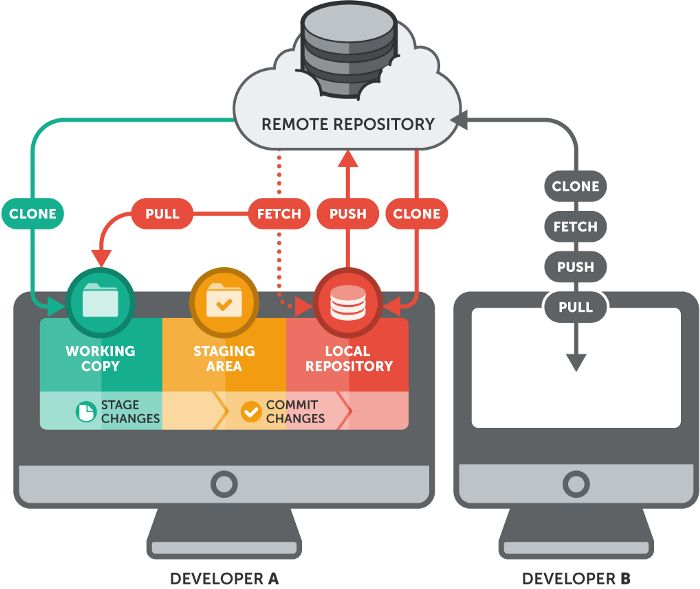

# Git in Environmental Programming
This is a quick introduction to Git for IUPWARE programmers. 

**For this exercise, kindly get in the groups you formed for your projects. Only one person needs to make the remote repo for your group's project. Follow along as a group and make sure that everyone does the rest of the tutorial so you are all connected to your group's remote.**

## Setting up Git

### Make your account
Since you're already on GitHub, head to the top right of the webpage and make an account. Choose the free option.

### Download and install Git
Your account on GitHub lets you make public/remote repos for your work. However, you also want the ability to easily pipe your work from your local computer to remote repos hosted on GitHub. Therefore, install [Github Desktop](https://desktop.github.com/download/)

### Login to your account on Github Desktop

See details [here](https://docs.github.com/en/desktop/installing-and-authenticating-to-github-desktop/authenticating-to-github-in-github-desktop).

### Create a secure connection between Git and your local machine
Generate an SSH key. This is unique to your machine/GitHub connection. It let's you connect and authenticate your local machine to the remote server on GitHub without having to give usernames/passwords.

You might already have keys, which should be in a hidden ".ssh" folder somewhere like "C:/Users/yourname/.ssh"

But you probably don't. So, open a command prompt and type this with your **GitHub email address** and ignore the name changes and password prompts by pressing the **Enter** key:
```
ssh-keygen -t rsa -b 4096 -C <your_github_email@something>
```

This produces a public/private key pair. The public key will have a ".pub" extension. Find your public key, open it and paste its contents in your GitHub account settings page under "SSH and GPG keys; New SSH key":
<p align="center">

</p>

Then, in Git Bash, establish this connection (type yes/press enter if it warns you):
```
ssh -T git@github.com
```

You have now created a connection between your local machine and your GitHub account. Now we're ready to start using Git.

## Using Git
How Git works is, it stores a _remote repository_ on Github, while you and your collaborators have a local copy of that repository on your PC. You can make changes/updates in your local copy. Once you have done something that is an improvement to the project, you can **commit** these changes to the _local repository_ and then **push** your _local repository_ to the _remote repository_. This updates the _remote repository_ with the changes you have made. Your group members can now all update their _local repository_ by **pulling** the changes from the _remote repository_.
<p align="center">

</p>

### Create a remote repo
In order to start with Git, you will need a remote repository. **One person per group**, open GitHub Desktop go to _file_ and choose _New repository_. Give the repository a name (for your group project e.g., EnvironmentalProgamming2024), choose a location for the _local repository_ on your PC and initialize it with readme. You have now created the _local repository_, now it's time to create a _remote repository_ linked to it. Click on _Publish Repository_ to create the _remote repository_.
Now on the left bottom go to add co-authors and add your group members to the repository.

### Connect repos

Now it is time for the **other group members** to create a _local repository_ by **cloning** the _remote repository_. 
Make sure to accept the invite to the new project first.
Go to _File_, _Clone Repository_ and then select the repo that was just created by your team member.

### Time to Git

1. Add
2. Commit
3. Push
4. Pull

### Reverting

But what if you srcrewed up? You pushed some garbage that broke the matrix. Yet, **conveniently**, you were doing frequent commits of your work, thereby allowing you to track your (stupid) changes.

You can see the changes under history


Imagine one of your group members screwed up. **After you have all pulled changes from the remote**.

If you want to revert the previous commit, this is simple:
```
git revert HEAD
```

If you want to revert an earlier commit, use its id:
```
git revert <commit_id>
```

# That's everything! Got Git it!

